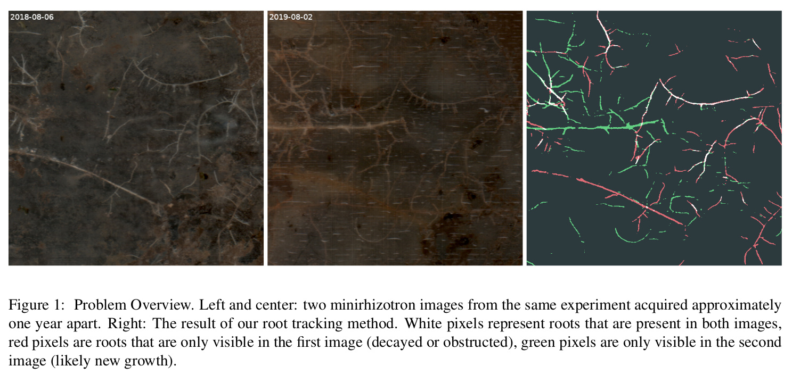

# Root-Tracking

Estimating root turnover from two minirhizotron images.

Source code for the paper "Tracking Growth and Decay of Plant Roots in Minirhizotron Images" (WACV2023).



***

Setup:

Tested with Python 3.7
```bash
python -m venv venv
source venv/bin/activate
pip install -r requirements.txt

#download pretrained models
python fetch_models.py
```


Inference (or see [the example notebook](example.ipynb)):
```bash
python infer.py \
       sample_data/CW_T001_L003_06.08.18_174938_009_SS.tiff \
       sample_data/CW_T001_L003_02.08.19_093548_022_CA.tiff \
       --segmentation_model=models/detection/2022-04-19_028a_WM.pt.zip \
       --similarity_model=models/tracking/2022-01-10_030_roottracking.stage2.pt.zip
```

Training:
```bash
python train.py \
       --inputfiles=path/to/data/*.tiff \
       --segmentation_model=path/to/segmentation/model.pt.zip
```

***

## Citation
```bibtex
@InProceedings{RootTracking_2023_WACV,
    author    = {Gillert, Alexander and Peters, Bo and Freiherr von Lukas, Uwe and Kreyling, J\"urgen and Blume-Werry, Gesche},
    title     = {Tracking Growth and Decay of Plant Roots in Minirhizotron Images},
    booktitle = {Proceedings of the IEEE/CVF Winter Conference on Applications of Computer Vision (WACV)},
    month     = {January},
    year      = {2023}
}
```
